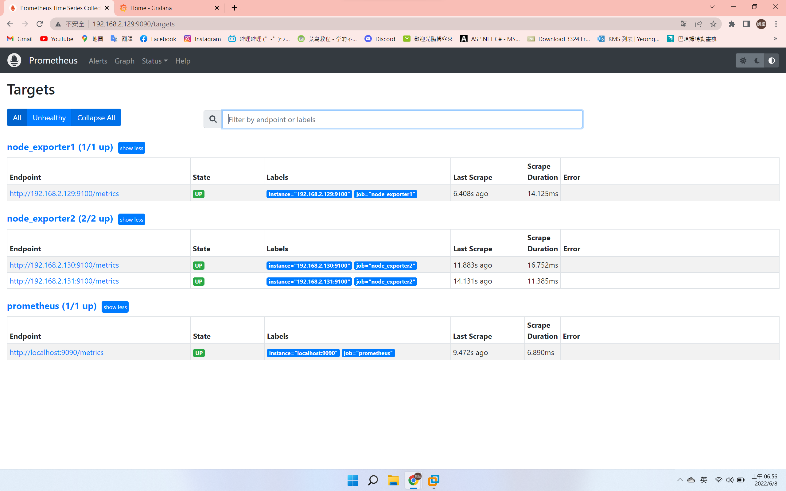

## 安裝prometheus
```
gedit /etc/hosts/

# centos
# 192.168.2.129 centos7-2
# 192.168.2.130 centos7-3
# 192.168.2.131 centos7-4

cd /home/jack/Downloads

wget https://github.com/prometheus/prometheus/releases/download/v2.35.0/prometheus-2.35.0.linux-amd64.tar.gz

groupadd prometheus

useradd -g prometheus -m -d /var/lib/prometheus -s /sbin/nologin prometheus

tar xf prometheus-2.35.0.linux-amd64.tar.gz

mv prometheus-2.35.0.linux-amd64 prometheus

mv prometheus /opt/module/

cd /usr/lib/systemd/system

gedit prometheus.service

# [Unit]
# Description=Prometheus
# After=network-online.target

# [Service]
# Type=simple
# Restart=on-failure
# ExecStart=/opt/module/prometheus/prometheus --config.file=/opt/module/prometheus/prometheus.yml --storage.tsdb.path=/opt/module/prometheus/data --storage.tsdb.retention=30d --web.enable-lifecycle --log.level=debug

# [Install]
# WantedBy=multi-user.target

cd /opt/module/

systemctl daemon-reload

systemctl start prometheus.service

wget https://github.com/prometheus/node_exporter/releases/download/v1.3.1/node_exporter-1.3.1.linux-amd64.tar.gz

tar xf node_exporter-1.3.1.linux-amd64.tar.gz

mv node_exporter-1.3.1.linux-amd64 /opt/module/

mv node_exporter-1.3.1.linux-amd64 node_exporter

gedit /opt/module/prometheus/prometheus.yml

# - job_name: 'node_exporter1'
#   static_configs:
#   - targets: ['192.168.2.129:9100']

# - job_name: 'node_exporter2'
#   static_configs:
#    - targets: ['192.168.2.130:9100', '192.168.2.131:9100']

systemctl daemon-reload

systemctl start node_exporter

systemctl restsart pushgateway

systemctl restsart pushgateway
```

<br>

## 安裝grafana
```
vim /etc/yum.repos.d/grafana.repo
# [grafana]
# name = grafana
# baseurl = https://packages.grafana.com/oss/rpm
# repo_gpgcheck = 1
# enabled = 1
# gpgcheck = 1
# gpgkey = http://packages.grafana.com/gpg.key
# sslverify = 1
# sslcacert = /etc/pki/tls/certs/ca-bundle.crt

yum install grafana -y

systemctl daemon-reload

systemctl start grafana-server
```

<br>

## 向prometheus發狀態
```
mkdir -p /app/scripts/pushgateway

cd /app/scripts/pushgateway

vim tcp_waiting_connections.sh

#!/bin/bash

# 获取hostname，且host不能为localhost (這部分可以不用寫)
# instance_name=`hostname -f | cut -d '.' -f 1`
# if [ $instance_name = "localhost" ];then
#  echo "Must FQDN hostname"
#  exit 1
# fi

# For waiting connections
# label="count_netstat_wait_connetions"
# count_netstat_wait_connetions=`netstat -an | grep -i wait | wc -l`
# echo "$label:$count_netstat_wait_connetions"
# echo "$label $count_netstat_wait_connetions" | curl --data-binary @- http://192.168.2.129:9091/metrics/job/pushgateway/instance/$instance_name

chmod +x tcp_waiting_connections.sh
./tcp_waiting_connections.sh
```